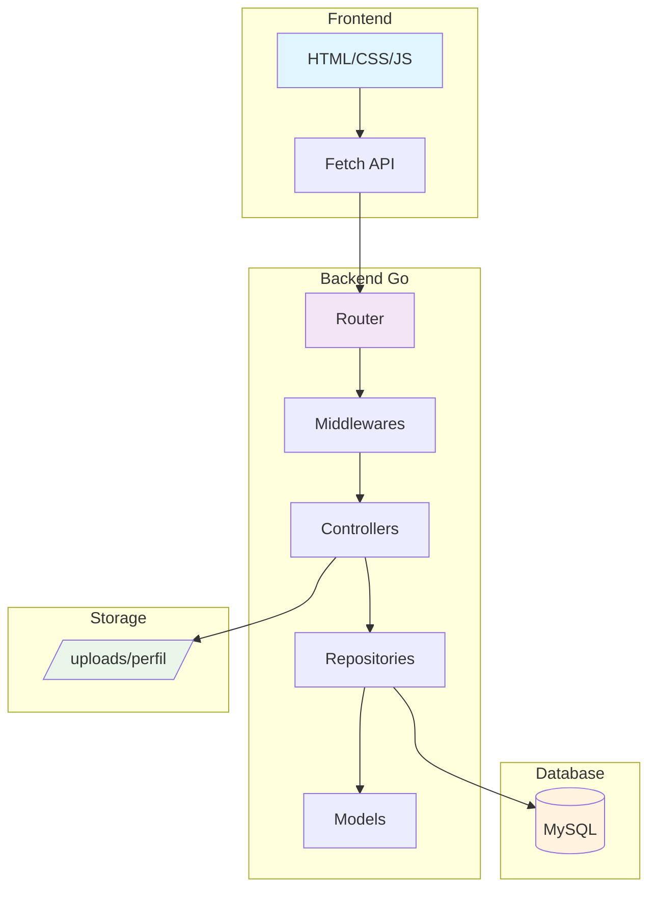

# 📚 Documentação - API Gestar Bem

Bem-vindo à documentação completa da **API Gestar Bem**, uma rede social desenvolvida em Go com frontend em HTML/CSS/JavaScript.

## 📋 Índice

- [🚀 Início Rápido](#-início-rápido)
- [🏗️ Arquitetura](#️-arquitetura)
- [📖 Documentação da API](#-documentação-da-api)
- [🎨 Frontend](#-frontend)
- [🗄️ Base de Dados](#️-base-de-dados)
- [✨ Funcionalidades](#-funcionalidades)

## 🚀 Início Rápido

### Pré-requisitos
- Go 1.19+
- MySQL 8.0+
- Navegador moderno

### Instalação

1. **Clone o repositório**
   ```bash
   git clone <repository-url>
   cd APi-gestar-bem
   ```

2. **Configure as variáveis de ambiente**
   ```bash
   cp .env.example .env
   # Edite o arquivo .env com suas configurações
   ```

3. **Instale as dependências**
   ```bash
   go mod download
   ```

4. **Configure a base de dados**
   ```bash
   # Execute os scripts SQL na ordem:
   mysql -u root -p < sql/sql.sql
   mysql -u root -p < sql/dados.sql
   mysql -u root -p < sql/add_foto_perfil.sql
   ```

5. **Execute o servidor**
   ```bash
   go run main.go
   ```

6. **Acesse o frontend**
   ```
   Abra frontend/index.html no navegador
   ```

## 🏗️ Arquitetura



```
APi-gestar-bem/
├── docs/                    # 📚 Documentação
│   ├── api/                # API endpoints
│   ├── frontend/           # Frontend docs
│   ├── database/           # Esquemas DB
│   └── features/           # Funcionalidades
├── src/                    # 🔧 Código fonte
│   ├── controllers/        # Controladores
│   ├── model/             # Modelos de dados
│   ├── repositorys/       # Camada de dados
│   ├── middlewares/       # Middlewares
│   └── router/            # Roteamento
├── frontend/              # 🎨 Interface web
├── sql/                   # 🗄️ Scripts SQL
└── uploads/               # 📁 Arquivos enviados
```

### Stack Tecnológica

**Backend:**
- **Go** - Linguagem principal
- **Gorilla Mux** - Roteamento HTTP
- **JWT** - Autenticação
- **MySQL** - Base de dados
- **bcrypt** - Hash de senhas

**Frontend:**
- **HTML5** - Estrutura
- **CSS3** - Estilização (com modo escuro)
- **JavaScript** - Interatividade
- **Fetch API** - Comunicação com API

## 📖 Documentação da API

### Endpoints Principais

| Método | Endpoint | Descrição | Auth |
|--------|----------|-----------|------|
| `POST` | `/usuarios` | Criar usuário | ❌ |
| `POST` | `/login` | Fazer login | ❌ |
| `GET` | `/usuarios` | Listar usuários | ✅ |
| `GET` | `/usuarios/{id}` | Buscar usuário | ✅ |
| `PUT` | `/usuarios/{id}` | Atualizar usuário | ✅ |
| `DELETE` | `/usuarios/{id}` | Deletar usuário | ✅ |
| `POST` | `/usuarios/{id}/foto-perfil` | Upload foto | ✅ |

**Documentação detalhada:** [📋 API Reference](api/README.md)

## 🎨 Frontend

Interface moderna e responsiva com:
- ✅ **Modo Escuro/Claro**
- ✅ **Design Responsivo**
- ✅ **Upload de Imagens**
- ✅ **Autenticação JWT**
- ✅ **Validações Client-side**

**Documentação:** [🎨 Frontend Guide](frontend/README.md)

## 🗄️ Base de Dados

### Tabelas Principais
- `usuarios` - Dados dos usuários
- `publicacoes` - Posts da rede social
- `comentarios` - Comentários nas publicações
- `seguidores` - Relacionamentos entre usuários

**Esquemas:** [🗄️ Database Schema](database/README.md)

## ✨ Funcionalidades

### Implementadas ✅
- [📸 Upload de Foto de Perfil](features/UPLOAD_FOTO_PERFIL.md)
- 🔐 Sistema de Autenticação JWT
- 👥 Gestão de Usuários
- 📝 Sistema de Publicações
- 💬 Sistema de Comentários
- 👥 Sistema de Seguidores
- 🌙 Modo Escuro/Claro

### Em Desenvolvimento 🚧
- 📱 App Mobile
- 🔔 Notificações em Tempo Real
- 📊 Analytics e Estatísticas
- 🎥 Upload de Vídeos

## 🤝 Contribuição

1. Fork o projeto
2. Crie uma branch para sua feature (`git checkout -b feature/AmazingFeature`)
3. Commit suas mudanças (`git commit -m 'Add some AmazingFeature'`)
4. Push para a branch (`git push origin feature/AmazingFeature`)
5. Abra um Pull Request

## 📝 Licença

Este projeto está sob a licença MIT. Veja o arquivo `LICENSE` para mais detalhes.

## 📞 Suporte

- 📧 Email: suporte@gestarbem.com
- 💬 Discord: [Gestar Bem Community](https://discord.gg/gestarbem)
- 🐛 Issues: [GitHub Issues](https://github.com/user/repo/issues)

---

**Desenvolvido com ❤️ pela equipe Gestar Bem** 