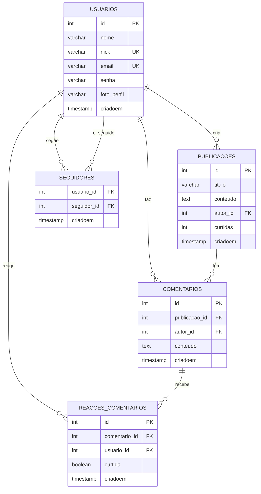

# 🗄️ Database Schema - Gestar Bem

Documentação completa da estrutura da base de dados da rede social Gestar Bem.

## 📋 Visão Geral

A base de dados utiliza **MySQL 8.0+** e segue os princípios de:
- **Normalização** adequada (3NF)
- **Integridade referencial** com foreign keys
- **Índices** para performance
- **Constraints** para validação de dados

## 🏗️ Diagrama ER



## 📊 Tabelas

### 👥 usuarios
Armazena informações dos usuários da rede social.

```sql
CREATE TABLE usuarios (
    id INT AUTO_INCREMENT PRIMARY KEY,
    nome VARCHAR(50) NOT NULL,
    nick VARCHAR(50) NOT NULL UNIQUE,
    email VARCHAR(50) NOT NULL UNIQUE,
    senha VARCHAR(100) NOT NULL,
    foto_perfil VARCHAR(255) DEFAULT NULL,
    criadoem TIMESTAMP DEFAULT CURRENT_TIMESTAMP
);
```

**Campos:**
- `id` - Identificador único (PK)
- `nome` - Nome completo do usuário
- `nick` - Nome de usuário único
- `email` - Email único para login
- `senha` - Hash bcrypt da senha
- `foto_perfil` - Nome do arquivo da foto de perfil
- `criadoem` - Data/hora de criação

**Índices:**
```sql
CREATE INDEX idx_usuarios_email ON usuarios(email);
CREATE INDEX idx_usuarios_nick ON usuarios(nick);
```

### 📝 publicacoes
Armazena as publicações/posts dos usuários.

```sql
CREATE TABLE publicacoes (
    id INT AUTO_INCREMENT PRIMARY KEY,
    titulo VARCHAR(100) NOT NULL,
    conteudo TEXT NOT NULL,
    autor_id INT NOT NULL,
    curtidas INT DEFAULT 0,
    criadoem TIMESTAMP DEFAULT CURRENT_TIMESTAMP,
    
    FOREIGN KEY (autor_id) REFERENCES usuarios(id) ON DELETE CASCADE
);
```

**Campos:**
- `id` - Identificador único (PK)
- `titulo` - Título da publicação
- `conteudo` - Conteúdo completo
- `autor_id` - ID do usuário autor (FK)
- `curtidas` - Contador de curtidas
- `criadoem` - Data/hora de criação

**Índices:**
```sql
CREATE INDEX idx_publicacoes_autor ON publicacoes(autor_id);
CREATE INDEX idx_publicacoes_data ON publicacoes(criadoem DESC);
```

### 💬 comentarios
Armazena comentários nas publicações.

```sql
CREATE TABLE comentarios (
    id INT AUTO_INCREMENT PRIMARY KEY,
    publicacao_id INT NOT NULL,
    autor_id INT NOT NULL,
    conteudo TEXT NOT NULL,
    criadoem TIMESTAMP DEFAULT CURRENT_TIMESTAMP,
    
    FOREIGN KEY (publicacao_id) REFERENCES publicacoes(id) ON DELETE CASCADE,
    FOREIGN KEY (autor_id) REFERENCES usuarios(id) ON DELETE CASCADE
);
```

**Campos:**
- `id` - Identificador único (PK)
- `publicacao_id` - ID da publicação (FK)
- `autor_id` - ID do usuário autor (FK)
- `conteudo` - Texto do comentário
- `criadoem` - Data/hora de criação

**Índices:**
```sql
CREATE INDEX idx_comentarios_publicacao ON comentarios(publicacao_id);
CREATE INDEX idx_comentarios_autor ON comentarios(autor_id);
```

### 👥 seguidores
Relacionamento many-to-many entre usuários (quem segue quem).

```sql
CREATE TABLE seguidores (
    usuario_id INT NOT NULL,
    seguidor_id INT NOT NULL,
    criadoem TIMESTAMP DEFAULT CURRENT_TIMESTAMP,
    
    PRIMARY KEY (usuario_id, seguidor_id),
    FOREIGN KEY (usuario_id) REFERENCES usuarios(id) ON DELETE CASCADE,
    FOREIGN KEY (seguidor_id) REFERENCES usuarios(id) ON DELETE CASCADE,
    
    CHECK (usuario_id != seguidor_id)
);
```

**Campos:**
- `usuario_id` - ID do usuário sendo seguido (FK)
- `seguidor_id` - ID do usuário seguidor (FK)
- `criadoem` - Data/hora que começou a seguir

**Constraints:**
- PK composta evita duplicatas
- CHECK evita auto-seguimento

### ❤️ reacoes_comentarios
Armazena curtidas/descurtidas nos comentários.

```sql
CREATE TABLE reacoes_comentarios (
    id INT AUTO_INCREMENT PRIMARY KEY,
    comentario_id INT NOT NULL,
    usuario_id INT NOT NULL,
    curtida BOOLEAN NOT NULL,
    criadoem TIMESTAMP DEFAULT CURRENT_TIMESTAMP,
    
    FOREIGN KEY (comentario_id) REFERENCES comentarios(id) ON DELETE CASCADE,
    FOREIGN KEY (usuario_id) REFERENCES usuarios(id) ON DELETE CASCADE,
    
    UNIQUE KEY unique_reacao (comentario_id, usuario_id)
);
```

**Campos:**
- `id` - Identificador único (PK)
- `comentario_id` - ID do comentário (FK)
- `usuario_id` - ID do usuário (FK)
- `curtida` - TRUE para curtida, FALSE para descurtida
- `criadoem` - Data/hora da reação

## 🔧 Scripts de Instalação

### 1. Estrutura Principal
```bash
mysql -u root -p < sql/sql.sql
```

### 2. Dados de Exemplo
```bash
mysql -u root -p < sql/dados.sql
```

### 3. Adição de Foto de Perfil
```bash
mysql -u root -p < sql/add_foto_perfil.sql
```

### 4. Comentários
```bash
mysql -u root -p < sql/comentarios.sql
```

### 5. Publicações
```bash
mysql -u root -p < sql/publicacoes.sql
```

## 📈 Consultas Comuns

### 👥 Usuários

#### Buscar usuário com estatísticas
```sql
SELECT 
    u.id,
    u.nome,
    u.nick,
    u.email,
    u.foto_perfil,
    u.criadoem,
    COUNT(DISTINCT s1.seguidor_id) as seguidores,
    COUNT(DISTINCT s2.usuario_id) as seguindo,
    COUNT(DISTINCT p.id) as publicacoes
FROM usuarios u
LEFT JOIN seguidores s1 ON u.id = s1.usuario_id
LEFT JOIN seguidores s2 ON u.id = s2.seguidor_id
LEFT JOIN publicacoes p ON u.id = p.autor_id
WHERE u.id = ?
GROUP BY u.id;
```

#### Buscar usuários por nome/nick
```sql
SELECT id, nome, nick, email, foto_perfil, criadoem
FROM usuarios
WHERE nome LIKE CONCAT('%', ?, '%') 
   OR nick LIKE CONCAT('%', ?, '%')
ORDER BY nome
LIMIT 20;
```

### 📝 Publicações

#### Feed de publicações com autor
```sql
SELECT 
    p.id,
    p.titulo,
    p.conteudo,
    p.curtidas,
    p.criadoem,
    u.nome as autor_nome,
    u.nick as autor_nick,
    u.foto_perfil as autor_foto
FROM publicacoes p
INNER JOIN usuarios u ON p.autor_id = u.id
ORDER BY p.criadoem DESC
LIMIT 20 OFFSET ?;
```

#### Publicações de usuários seguidos
```sql
SELECT 
    p.id,
    p.titulo,
    p.conteudo,
    p.curtidas,
    p.criadoem,
    u.nome as autor_nome,
    u.nick as autor_nick
FROM publicacoes p
INNER JOIN usuarios u ON p.autor_id = u.id
INNER JOIN seguidores s ON u.id = s.usuario_id
WHERE s.seguidor_id = ?
ORDER BY p.criadoem DESC
LIMIT 20;
```

### 💬 Comentários

#### Comentários de uma publicação
```sql
SELECT 
    c.id,
    c.conteudo,
    c.criadoem,
    u.nome as autor_nome,
    u.nick as autor_nick,
    u.foto_perfil as autor_foto,
    COUNT(rc.id) as total_reacoes,
    SUM(CASE WHEN rc.curtida = 1 THEN 1 ELSE 0 END) as curtidas
FROM comentarios c
INNER JOIN usuarios u ON c.autor_id = u.id
LEFT JOIN reacoes_comentarios rc ON c.id = rc.comentario_id
WHERE c.publicacao_id = ?
GROUP BY c.id
ORDER BY c.criadoem ASC;
```

## 🚀 Performance

### 📊 Índices Recomendados
```sql
-- Usuários
CREATE INDEX idx_usuarios_email ON usuarios(email);
CREATE INDEX idx_usuarios_nick ON usuarios(nick);

-- Publicações
CREATE INDEX idx_publicacoes_autor ON publicacoes(autor_id);
CREATE INDEX idx_publicacoes_data ON publicacoes(criadoem DESC);
CREATE INDEX idx_publicacoes_curtidas ON publicacoes(curtidas DESC);

-- Comentários
CREATE INDEX idx_comentarios_publicacao ON comentarios(publicacao_id);
CREATE INDEX idx_comentarios_autor ON comentarios(autor_id);
CREATE INDEX idx_comentarios_data ON comentarios(criadoem);

-- Seguidores
CREATE INDEX idx_seguidores_usuario ON seguidores(usuario_id);
CREATE INDEX idx_seguidores_seguidor ON seguidores(seguidor_id);

-- Reações
CREATE INDEX idx_reacoes_comentario ON reacoes_comentarios(comentario_id);
CREATE INDEX idx_reacoes_usuario ON reacoes_comentarios(usuario_id);
```

### 🔧 Otimizações

#### Configurações MySQL
```sql
-- my.cnf
[mysqld]
innodb_buffer_pool_size = 1G
innodb_log_file_size = 256M
query_cache_size = 128M
max_connections = 200
```

#### Particionamento (para grandes volumes)
```sql
-- Particionar publicações por data
ALTER TABLE publicacoes 
PARTITION BY RANGE (YEAR(criadoem)) (
    PARTITION p2024 VALUES LESS THAN (2025),
    PARTITION p2025 VALUES LESS THAN (2026),
    PARTITION p_future VALUES LESS THAN MAXVALUE
);
```

## 🔒 Segurança

### 🛡️ Usuário da Aplicação
```sql
-- Criar usuário específico para a aplicação
CREATE USER 'gestarbem_app'@'localhost' IDENTIFIED BY 'senha_forte_aqui';

-- Conceder apenas permissões necessárias
GRANT SELECT, INSERT, UPDATE, DELETE ON gestarbem.* TO 'gestarbem_app'@'localhost';

-- Remover permissões perigosas
REVOKE CREATE, DROP, ALTER ON gestarbem.* FROM 'gestarbem_app'@'localhost';
```

### 🔐 Boas Práticas
- **Senhas**: Sempre usar bcrypt com salt
- **SQL Injection**: Usar prepared statements
- **Backup**: Backup diário automatizado
- **Logs**: Monitorar queries suspeitas
- **SSL**: Conexão criptografada

## 📊 Monitoramento

### 📈 Queries de Análise
```sql
-- Top usuários por seguidores
SELECT u.nome, u.nick, COUNT(s.seguidor_id) as seguidores
FROM usuarios u
LEFT JOIN seguidores s ON u.id = s.usuario_id
GROUP BY u.id
ORDER BY seguidores DESC
LIMIT 10;

-- Publicações mais curtidas
SELECT p.titulo, p.curtidas, u.nome as autor
FROM publicacoes p
INNER JOIN usuarios u ON p.autor_id = u.id
ORDER BY p.curtidas DESC
LIMIT 10;

-- Atividade por dia
SELECT DATE(criadoem) as data, COUNT(*) as publicacoes
FROM publicacoes
WHERE criadoem >= DATE_SUB(NOW(), INTERVAL 30 DAY)
GROUP BY DATE(criadoem)
ORDER BY data DESC;
```

## 🔄 Migrations

### Estrutura de Versionamento
```
sql/
├── migrations/
│   ├── 001_initial_schema.sql
│   ├── 002_add_foto_perfil.sql
│   ├── 003_add_comentarios.sql
│   └── 004_add_reacoes.sql
└── rollbacks/
    ├── 001_rollback.sql
    └── 002_rollback.sql
```

### Script de Migration
```bash
#!/bin/bash
# migrate.sh
VERSION=$1
mysql -u root -p gestarbem < sql/migrations/${VERSION}_*.sql
echo "Migration $VERSION aplicada com sucesso"
```

## 📋 Backup e Restore

### Backup Completo
```bash
# Backup completo
mysqldump -u root -p --single-transaction --routines --triggers gestarbem > backup_$(date +%Y%m%d_%H%M%S).sql

# Backup apenas estrutura
mysqldump -u root -p --no-data gestarbem > schema_backup.sql

# Backup apenas dados
mysqldump -u root -p --no-create-info gestarbem > data_backup.sql
```

### Restore
```bash
# Restore completo
mysql -u root -p gestarbem < backup_20250611_223000.sql

# Restore apenas estrutura
mysql -u root -p gestarbem < schema_backup.sql
```

---

**Base de dados otimizada para performance e escalabilidade** 🚀 