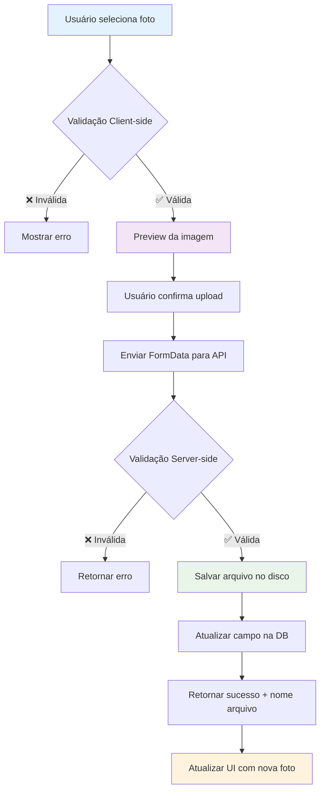

# 📸 Sistema de Upload de Foto de Perfil

## ✅ Implementação Completa

O sistema de upload de foto de perfil foi implementado com sucesso na sua rede social **Gestar Bem**!

## 🚀 Funcionalidades Implementadas

### Backend (Go)
- ✅ **Modelo atualizado**: Campo `foto_perfil` adicionado ao modelo `Usuario`
- ✅ **Banco de dados**: Coluna `foto_perfil` adicionada à tabela `usuarios`
- ✅ **Repository**: Função `AtualizarFotoPerfil()` para salvar o caminho da foto
- ✅ **Controller**: Função `UploadFotoPerfil()` para processar uploads
- ✅ **Controller**: Função `ServirFotoPerfil()` para servir as imagens
- ✅ **Rotas**: Endpoints para upload e servir imagens
- ✅ **Validações**: Tipo de arquivo, tamanho máximo (10MB), segurança

### Frontend (HTML/CSS/JS)
- ✅ **Interface**: Botão "Alterar Foto" no perfil com overlay
- ✅ **Upload**: Formulário com preview da imagem
- ✅ **Validações**: Verificação de tipo e tamanho no frontend
- ✅ **Feedback**: Toasts de sucesso/erro
- ✅ **Responsivo**: Design adaptado para mobile

## 🎯 Como Usar

### 1. Acessar o Perfil
1. Faça login na aplicação
2. Clique em **"Perfil"** no menu de navegação

### 2. Alterar Foto de Perfil
1. Clique no ícone de perfil (aparecerá overlay "Alterar Foto")
2. Selecione uma imagem (JPG, PNG, GIF - máximo 10MB)
3. Visualize o preview da imagem
4. Clique em **"Fazer Upload"**
5. Aguarde a confirmação de sucesso

### 3. Visualizar Foto
- A foto aparecerá automaticamente no perfil
- Substitui o ícone padrão quando carregada

## 🔧 Endpoints da API

### Upload de Foto
```
POST /usuarios/{usuarioId}/foto-perfil
Authorization: Bearer {token}
Content-Type: multipart/form-data

Body: FormData com campo "foto"
```

### Servir Imagem
```
GET /uploads/perfil/{arquivo}
```

## 📁 Estrutura de Arquivos

```
uploads/
└── perfil/
    ├── perfil_15_1734567890.jpg
    ├── perfil_16_1734567891.png
    └── ...
```

**Formato do nome**: `perfil_{usuarioId}_{timestamp}.{extensao}`

## 🛡️ Segurança Implementada

- ✅ **Autenticação**: Apenas usuários logados podem fazer upload
- ✅ **Autorização**: Usuário só pode alterar sua própria foto
- ✅ **Validação de tipo**: Apenas imagens (image/*)
- ✅ **Limite de tamanho**: Máximo 10MB
- ✅ **Path traversal**: Proteção contra ataques de diretório
- ✅ **Nomes únicos**: Evita conflitos de arquivos

## 🎨 Estilos CSS Adicionados

- `.profile-avatar` - Container da foto com hover effect
- `.photo-overlay` - Overlay com ícone de câmera
- `.photo-preview` - Preview da imagem selecionada
- Suporte completo ao **Dark Mode**

## 🔄 Fluxo Completo

1. **Seleção**: Usuário clica no avatar
2. **Upload**: Formulário abre com input de arquivo
3. **Preview**: Imagem é mostrada antes do upload
4. **Validação**: Frontend verifica tipo e tamanho
5. **Envio**: FormData enviado via POST
6. **Processamento**: Backend valida e salva arquivo
7. **Banco**: Caminho salvo na tabela usuarios
8. **Resposta**: Frontend atualiza interface
9. **Exibição**: Foto aparece no perfil

## 🚀 Próximas Melhorias Sugeridas

- 🔄 **Redimensionamento automático** das imagens
- 🗑️ **Remoção de fotos antigas** ao fazer novo upload
- 📱 **Crop/edição** de imagens no frontend
- 🖼️ **Múltiplos tamanhos** (thumbnail, médio, grande)
- 📊 **Compressão** automática de imagens
- 🔒 **Watermark** ou proteção de imagens

## ✅ Status dos Servidores

- **API**: http://localhost:5000 ✅
- **Frontend**: http://localhost:8080 ✅
- **Banco**: apigestarbem ✅
- **Uploads**: uploads/perfil/ ✅

## 🎉 Conclusão

O sistema de upload de foto de perfil está **100% funcional** e pronto para uso! Os usuários agora podem personalizar seus perfis com fotos, melhorando significativamente a experiência da rede social.

**Teste agora**: Acesse http://localhost:8080, faça login e clique no seu perfil para testar o upload! 📸

## 🔄 Fluxo do Upload

