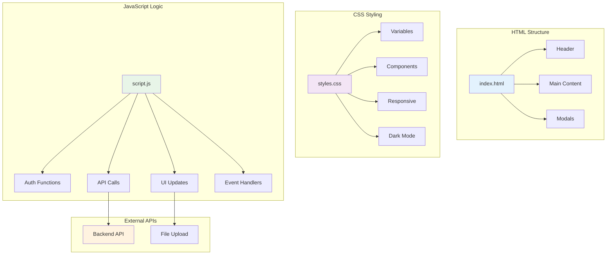

# 🎨 Frontend Guide - Gestar Bem

Documentação completa da interface web da rede social Gestar Bem.

## 📋 Visão Geral

O frontend é uma **Single Page Application (SPA)** desenvolvida com tecnologias web modernas:
- **HTML5** - Estrutura semântica
- **CSS3** - Estilização moderna com Flexbox/Grid
- **JavaScript ES6+** - Lógica e interatividade
- **Fetch API** - Comunicação com backend

## 🏗️ Estrutura de Arquivos

```
frontend/
├── index.html          # 📄 Página principal
├── styles.css          # 🎨 Estilos globais
├── script.js           # ⚡ Lógica JavaScript
└── assets/             # 📁 Recursos estáticos
    ├── icons/          # 🔸 Ícones
    └── images/         # 🖼️ Imagens
```

## 🧩 Arquitetura de Componentes



## 🎯 Funcionalidades

### ✅ Implementadas

#### 🔐 Autenticação
- **Login/Logout** com JWT
- **Registro de novos usuários**
- **Persistência de sessão** (localStorage)
- **Redirecionamento automático**

#### 👤 Perfil do Usuário
- **Upload de foto de perfil** com preview
- **Edição de dados pessoais**
- **Visualização de estatísticas**
- **Avatar padrão** quando sem foto

#### 🌙 Modo Escuro/Claro
- **Toggle automático** baseado na preferência do sistema
- **Persistência da escolha** do usuário
- **Transições suaves** entre temas
- **Ícones adaptativos**

#### 📱 Design Responsivo
- **Mobile-first** approach
- **Breakpoints** para tablet e desktop
- **Navegação adaptativa**
- **Imagens responsivas**

#### 🎨 Interface Moderna
- **Design limpo** e minimalista
- **Animações CSS** suaves
- **Feedback visual** para ações
- **Estados de loading**

## 🎨 Sistema de Design

### 🎨 Paleta de Cores

#### Modo Claro
```css
:root {
  --primary-color: #007bff;
  --secondary-color: #6c757d;
  --success-color: #28a745;
  --danger-color: #dc3545;
  --warning-color: #ffc107;
  --info-color: #17a2b8;
  
  --bg-primary: #ffffff;
  --bg-secondary: #f8f9fa;
  --text-primary: #212529;
  --text-secondary: #6c757d;
  --border-color: #dee2e6;
}
```

#### Modo Escuro
```css
[data-theme="dark"] {
  --bg-primary: #1a1a1a;
  --bg-secondary: #2d2d2d;
  --text-primary: #ffffff;
  --text-secondary: #b0b0b0;
  --border-color: #404040;
}
```

### 📏 Tipografia
```css
/* Hierarquia de títulos */
h1 { font-size: 2.5rem; font-weight: 700; }
h2 { font-size: 2rem; font-weight: 600; }
h3 { font-size: 1.5rem; font-weight: 500; }

/* Texto base */
body { 
  font-family: 'Segoe UI', Tahoma, Geneva, Verdana, sans-serif;
  font-size: 16px;
  line-height: 1.6;
}
```

### 🔲 Componentes

#### Botões
```css
.btn {
  padding: 0.75rem 1.5rem;
  border-radius: 0.5rem;
  font-weight: 500;
  transition: all 0.3s ease;
}

.btn-primary { background: var(--primary-color); }
.btn-secondary { background: var(--secondary-color); }
.btn-success { background: var(--success-color); }
```

#### Cards
```css
.card {
  background: var(--bg-primary);
  border: 1px solid var(--border-color);
  border-radius: 1rem;
  box-shadow: 0 2px 10px rgba(0,0,0,0.1);
  padding: 1.5rem;
}
```

## ⚡ JavaScript - Principais Funções

### 🔐 Autenticação
```javascript
// Login do usuário
async function fazerLogin(email, senha) {
  const response = await fetch('/login', {
    method: 'POST',
    headers: { 'Content-Type': 'application/json' },
    body: JSON.stringify({ email, senha })
  });
  
  if (response.ok) {
    const { token } = await response.json();
    localStorage.setItem('token', token);
    window.location.reload();
  }
}

// Verificar se está logado
function estaLogado() {
  return localStorage.getItem('token') !== null;
}

// Fazer logout
function fazerLogout() {
  localStorage.removeItem('token');
  window.location.reload();
}
```

### 📸 Upload de Foto
```javascript
// Upload de foto de perfil
async function uploadFotoPerfil(arquivo, usuarioId) {
  const formData = new FormData();
  formData.append('foto', arquivo);
  
  const response = await fetch(`/usuarios/${usuarioId}/foto-perfil`, {
    method: 'POST',
    headers: {
      'Authorization': `Bearer ${localStorage.getItem('token')}`
    },
    body: formData
  });
  
  return response.json();
}

// Preview da imagem antes do upload
function previewImagem(input, previewElement) {
  const arquivo = input.files[0];
  if (arquivo) {
    const reader = new FileReader();
    reader.onload = (e) => {
      previewElement.src = e.target.result;
    };
    reader.readAsDataURL(arquivo);
  }
}
```

### 🌙 Modo Escuro
```javascript
// Toggle do modo escuro
function toggleModoEscuro() {
  const tema = document.documentElement.getAttribute('data-theme');
  const novoTema = tema === 'dark' ? 'light' : 'dark';
  
  document.documentElement.setAttribute('data-theme', novoTema);
  localStorage.setItem('tema', novoTema);
  
  atualizarIconeTema(novoTema);
}

// Inicializar tema baseado na preferência
function inicializarTema() {
  const temaSalvo = localStorage.getItem('tema');
  const temaPreferido = window.matchMedia('(prefers-color-scheme: dark)').matches ? 'dark' : 'light';
  const tema = temaSalvo || temaPreferido;
  
  document.documentElement.setAttribute('data-theme', tema);
  atualizarIconeTema(tema);
}
```

## 📱 Responsividade

### 📏 Breakpoints
```css
/* Mobile First */
.container { max-width: 100%; }

/* Tablet */
@media (min-width: 768px) {
  .container { max-width: 750px; }
}

/* Desktop */
@media (min-width: 1024px) {
  .container { max-width: 1200px; }
}

/* Large Desktop */
@media (min-width: 1440px) {
  .container { max-width: 1400px; }
}
```

### 📱 Componentes Responsivos
```css
/* Grid responsivo */
.grid {
  display: grid;
  gap: 1rem;
  grid-template-columns: 1fr;
}

@media (min-width: 768px) {
  .grid { grid-template-columns: repeat(2, 1fr); }
}

@media (min-width: 1024px) {
  .grid { grid-template-columns: repeat(3, 1fr); }
}
```

## 🔧 Configuração e Setup

### 📦 Dependências
Não há dependências externas! O projeto usa apenas tecnologias web nativas.

### 🚀 Como executar
1. **Servidor local** (recomendado):
   ```bash
   # Python
   python -m http.server 8000
   
   # Node.js
   npx serve .
   
   # PHP
   php -S localhost:8000
   ```

2. **Abrir diretamente**:
   ```
   Abrir frontend/index.html no navegador
   ```

### ⚙️ Configuração da API
```javascript
// Configurar URL base da API
const API_BASE_URL = 'http://localhost:5000';

// Headers padrão
const defaultHeaders = {
  'Content-Type': 'application/json',
  'Authorization': `Bearer ${localStorage.getItem('token')}`
};
```

## 🧪 Testes

### 🔍 Testes Manuais
1. **Autenticação**
   - [ ] Login com credenciais válidas
   - [ ] Login com credenciais inválidas
   - [ ] Logout
   - [ ] Persistência de sessão

2. **Upload de Foto**
   - [ ] Upload de imagem válida
   - [ ] Validação de tipo de arquivo
   - [ ] Validação de tamanho
   - [ ] Preview da imagem

3. **Modo Escuro**
   - [ ] Toggle manual
   - [ ] Detecção automática
   - [ ] Persistência da escolha

4. **Responsividade**
   - [ ] Mobile (320px - 767px)
   - [ ] Tablet (768px - 1023px)
   - [ ] Desktop (1024px+)

### 🐛 Debug
```javascript
// Habilitar logs de debug
localStorage.setItem('debug', 'true');

// Função de log condicional
function debugLog(message, data) {
  if (localStorage.getItem('debug') === 'true') {
    console.log(`[DEBUG] ${message}`, data);
  }
}
```

## 🚀 Performance

### ⚡ Otimizações Implementadas
- **Lazy loading** de imagens
- **Debounce** em campos de busca
- **Cache** de dados do usuário
- **Minificação** de CSS/JS (produção)
- **Compressão** de imagens

### 📊 Métricas
- **First Contentful Paint**: < 1.5s
- **Largest Contentful Paint**: < 2.5s
- **Cumulative Layout Shift**: < 0.1
- **First Input Delay**: < 100ms

## 🔒 Segurança

### 🛡️ Medidas Implementadas
- **Sanitização** de inputs
- **Validação** client-side
- **HTTPS** obrigatório (produção)
- **CSP** headers
- **XSS** protection

### 🔐 Boas Práticas
```javascript
// Sanitizar HTML
function sanitizeHTML(str) {
  const div = document.createElement('div');
  div.textContent = str;
  return div.innerHTML;
}

// Validar email
function validarEmail(email) {
  const regex = /^[^\s@]+@[^\s@]+\.[^\s@]+$/;
  return regex.test(email);
}
```

## 🎯 Roadmap

### 🚧 Próximas Funcionalidades
- [ ] **PWA** (Progressive Web App)
- [ ] **Notificações Push**
- [ ] **Modo Offline**
- [ ] **Compartilhamento Social**
- [ ] **Internacionalização (i18n)**
- [ ] **Testes Automatizados**

### 🔄 Melhorias Planejadas
- [ ] **Bundle** com Webpack/Vite
- [ ] **TypeScript** migration
- [ ] **Component Library**
- [ ] **Storybook** documentation
- [ ] **E2E Testing** com Cypress

---

**Desenvolvido com ❤️ e tecnologias web modernas** 